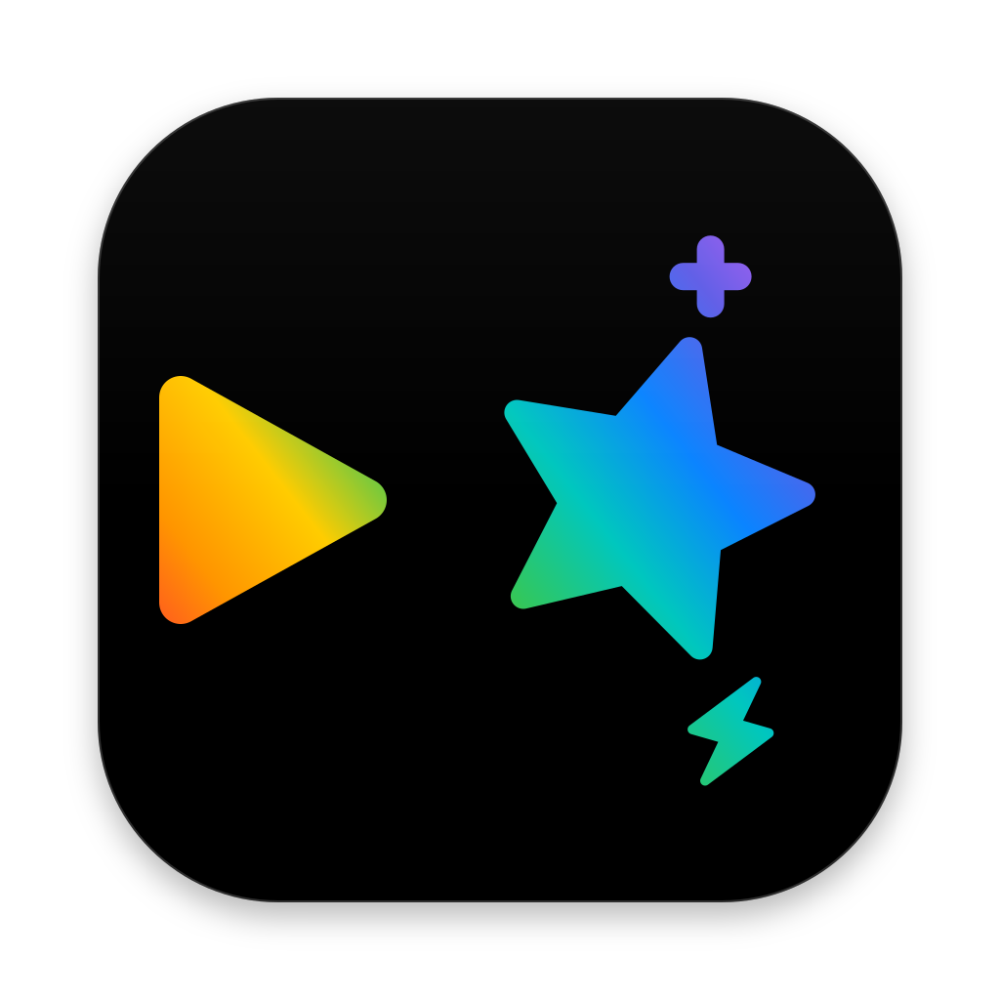
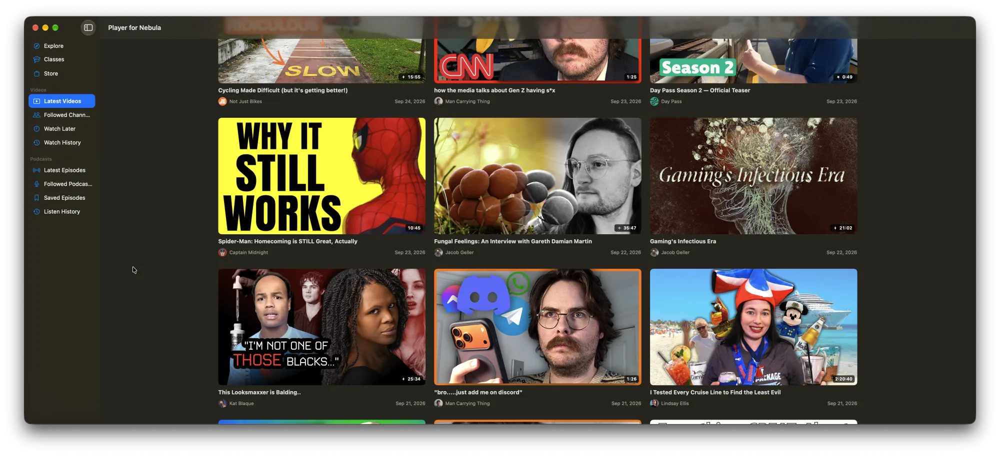
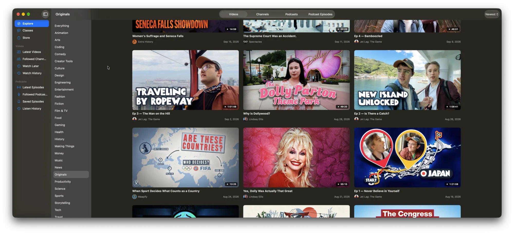

# Player for Nebula

A native macOS app for [Nebula](https://nebula.tv).
Log into your Nebula account, watch videos, follow your favorite creators, and catch up on your watch later queue.
Listen to podcasts, and discover new creators on Nebula.

This is a fully native app including the whole interface and video player.
Pretty much all features of Nebula are implemented besides classes.
This is a significantly more lightweight way to browse, watch, and listen to Nebula since it doesn't require you run a full web app.

## Not affiliated with Nebula

**This project is not affiliated with, endorsed by, or sponsored by Nebula, or Nebula Entertainment & Broadcasting LLC.** "Nebula" is a trademark of its owner and is used here only to describe what the app works with.

You need your own Nebula subscription to use this app.

## How it works





The app does not bypass any security measures. It does the same thing your web browser does when you watch Nebula at nebula.tv:

- You sign in on the regular Nebula login page, shown inside the app.
- The app uses the session from that sign-in to call the same APIs the Nebula website calls.
- Videos play from the same streams the website plays, using a native video player.

The app does not download videos or remove DRM.
The APIs this app relies on are internal and are subject to change, so this app may break at any time.
If the app does break, let me know by filing a bug report on Github and I'll try to fix it.

## Features

- Latest videos from channels you follow
- Channel pages with follow buttons and exclusivity filters
- Watch later and watch history
- Resumes playback where you left off and saves your progress while you watch

## Requirements

- macOS 26 or later
- A Nebula subscription

## Installing

Download `PlayerForNebula.dmg` from the [latest release](https://github.com/SeriousBug/mac-player-for-nebula/releases/latest), open it, and drag Player for Nebula into Applications.

## Building

Install [XcodeGen](https://github.com/yonaskolb/XcodeGen) and [just](https://github.com/casey/just), then run:

```sh
just run
```

This generates the Xcode project, builds the app, and launches it. Run `just open` to open the project in Xcode.

## License

MIT. See [LICENSE](LICENSE).
